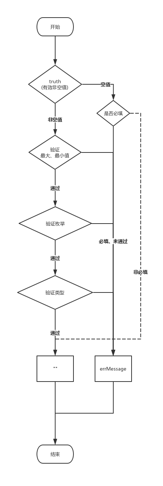

> 验证器

-------------------

## 引用

```javascript
import { Validator } from '@huteming/util'

const v = new Validator()

v.add(value, errorMessage, options)

const message = v.done()
```

## 示例

```javascript
const v = new Validator()

v.add('', 'error with required', { required: true })
v.add('123', '', { type: 'number' }) // success
v.add(123, 'error with min', { type: 'number', min: 234 })
v.add('123', 'error with max', { type: 'number', max: 100 })
v.add('enum', 'error with enum', { enum: ['enumer'] })
v.add(['enum', 'other'], 'error with array enum', { type: 'array', enum: ['enum'] })

const message = v.done()
```

## 实例方法

| name | 说明 | 参数 |
|----------|------------|------------|
| add | 添加验证器 | |
| done | 执行验证，返回 errorMessage。正确时返回 "" | |

### add 参数

| name | 说明 | 类型 | 可选值 | 默认值 |
|-----------|------------|-------------|------------|-----------|
| value | 需要校验的值 | Any | |
| errorMessage | 错误提示 | String | | |
| options | 验证器 | Object | | |

### options

注意：这里允许字符串类型的数字. 通过 type 为 number 去验证 min, max 等；具体看示例

| name | 说明 | 类型 | 可选值 | 默认值 |
|-----------|------------|-------------|------------|-----------|
| type | 类型 | String | `string`, `number`, `boolean`, `array`, `date`, `email`, `mobile`, `regexp` | `string` |
| required | 是否必填 | Boolean | | `false` |
| min | 最小值(包含该值); `string` 和 `array` 验证最小长度, `number` 验证最小值 | Number | | |
| max | 最大值(包含该值); `string` 和 `array` 验证最大长度, `number` 验证最大值 | Number | | |
| enum | 所有可能值枚举 | Array | | |
| regexp | type 为 regexp 时, 用作匹配的正则表达式, | String, RegExp | | |

## 验证流程简述


